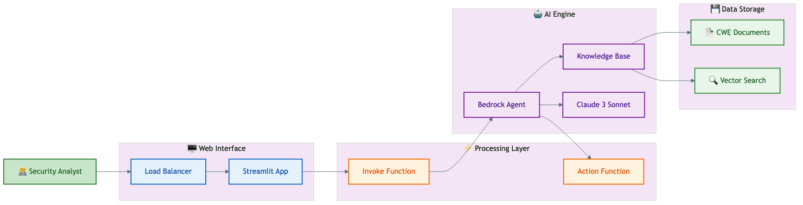

# Security Advisory Assistant

An AI-powered chatbot that helps security analysts with Common CNA tasks including CWE assignment, CVSS scoring, and vulnerability analysis using Amazon Bedrock.

## Overview

This application leverages Amazon Bedrock with Knowledge Bases and Agents to provide intelligent assistance for security vulnerability analysis. Given a vulnerability description, the assistant can recommend appropriate CWE classifications with supporting reasoning based on FIRST guidance and CWE documentation.

## Architecture

The solution uses a serverless architecture built with AWS CDK. The diagram below shows how a user's question flows through the system to generate an AI-powered response.



| Color            | Component        | Description                                                          |
| ---------------- | ---------------- | -------------------------------------------------------------------- |
| 🟢 Green (User)  | Security Analyst | You! The person asking questions about vulnerabilities               |
| 🔵 Blue          | Web Interface    | The website you interact with (Load Balancer + Streamlit App)        |
| 🟠 Orange        | Processing       | AWS Lambda functions that coordinate requests                        |
| 🟣 Purple        | AI Engine        | Amazon Bedrock - the "brain" that understands and answers questions  |
| 🟢 Green (Data)  | Data Storage     | CWE documents and vector search index                                |

**How it works:** You ask a question → the web app sends it to the AI engine → the AI searches the knowledge base and generates a response → you get an expert-level CWE recommendation with reasoning.

## Quick Start

### Prerequisites

- Python 3.11+
- Docker
- AWS CDK 2.114.1+
- AWS account with Bedrock access (Claude and Titan models enabled)

### Deployment

1. Create and activate virtual environment:

   ```bash
   python3 -m venv .venv
   source .venv/bin/activate
   ```

2. Install dependencies:

   ```bash
   pip install -r requirements.txt
   ```

3. Configure environment (create `code/streamlit-app/.env`):

   ```env
   ACCOUNT_ID=<your-account-id>
   AWS_REGION=<your-region>
   LAMBDA_FUNCTION_NAME=invokeAgentLambda
   ```

4. Deploy:

   ```bash
   cdk bootstrap  # first time only
   cdk deploy
   ```

Initial deployment takes 30-45 minutes. Access the chatbot via the URL in CloudFormation outputs.

### Cleanup

```bash
cdk destroy
```

Note: Manually delete any S3 buckets created by the stack.

## Project Structure

```text
security-advisory-assistant/
├── code/
│   ├── code_stack.py              # Main CDK stack definition
│   ├── lambdas/
│   │   ├── action-lambda/         # Bedrock Agent action handler
│   │   ├── create-index-lambda/   # OpenSearch index creation
│   │   ├── invoke-lambda/         # Agent invocation endpoint
│   │   └── update-lambda/         # Post-deployment updates
│   ├── layers/                    # Lambda layers (boto3, opensearch)
│   ├── security/                  # Security middleware and config
│   └── streamlit-app/             # Web UI application
├── assets/
│   ├── agent_api_schema/          # Bedrock Agent API definitions
│   ├── data_query_data_source/    # Structured data for Athena
│   ├── diagrams/                  # Architecture diagrams
│   └── knowledgebase_data_source/ # CWE knowledge base documents
├── configs/                       # Configuration files
├── docs/                          # Extended documentation
└── tests/                         # Unit tests
```

## Key Modules

### CDK Stack (`code/code_stack.py`)

The `CodeStack` class deploys all AWS infrastructure:

```python
class CodeStack(Stack):
    """Main CDK stack for Security Advisory Assistant."""
    
    def __init__(self, scope: Construct, construct_id: str, **kwargs) -> None
```

Key methods:

- `create_kms_key()` - Creates KMS key for encryption
- `create_data_source_bucket()` - S3 buckets for assets and Athena
- `create_glue_database()` - Glue crawler and database for structured data
- `create_opensearch_index()` - OpenSearch Serverless vector store
- `create_bedrock_agent()` - Bedrock Agent with Knowledge Base
- `create_streamlit_app()` - ECS Fargate service for web UI

### Invoke Lambda (`code/lambdas/invoke-lambda/index.py`)

Handles agent invocation requests from the Streamlit app:

```python
def lambda_handler(event: Dict[str, Any], context: Any) -> Dict[str, Any]
    """Main Lambda handler with security controls."""

def invoke_agent(user_input: str, session_id: str) -> Dict[str, Any]
    """Get response from Agent with rate limiting and validation."""

def get_agent_response(response: Dict[str, Any]) -> Tuple[str, str, List[str]]
    """Process streaming agent response into text and citations."""
```

### Action Lambda (`code/lambdas/action-lambda/index.py`)

Processes Bedrock Agent action group requests:

```python
def lambda_handler(event: Dict[str, Any], context: Any) -> Dict[str, Any]
    """Main Lambda handler with error handling."""

def get_response(event: Dict[str, Any], context: Any) -> Dict[str, Any]
    """Get response from RAG or Query engine with security controls."""
```

API paths:
- `/uc1` - Knowledge base document retrieval
- `/uc2` - SQL query generation via text-to-SQL

### Security Middleware (`code/security/middleware.py`)

Decorators for security controls:
- `@validate_input` - Input sanitization and validation
- `@error_handler` - Secure error handling
- `@audit_log` - Audit logging for compliance
- `@rate_limit(max_calls, time_window)` - Rate limiting

## Configuration

Configuration is managed via `cdk.json` under the `context.config` key:

```json
{
  "config": {
    "paths": {
      "knowledgebase_file_name": "cna_wisdom.zip",
      "athena_table_data_prefix": "ec2_pricing"
    },
    "models": {
      "bedrock_agent_foundation_model": "anthropic.claude-3-sonnet-20240229-v1:0"
    },
    "bedrock_instructions": {
      "agent_instruction": "...",
      "knowledgebase_instruction": "..."
    }
  }
}
```

## Security Features

- KMS encryption for S3 buckets and CloudWatch logs
- Input validation and sanitization
- Rate limiting on agent invocations
- Audit logging for compliance
- Configurable security group IP restrictions:

```bash
# Restrict to current IP
cdk deploy --parameters SourceIpAddress=$(curl -s https://checkip.amazonaws.com)/32

# Allow all (default)
cdk deploy
```

## Customization

### Adding Custom Knowledge Base Data

1. Place documents in `assets/knowledgebase_data_source/`
2. Update `cdk.json` → `paths.knowledgebase_file_name`
3. Update `bedrock_instructions.knowledgebase_instruction`

### Adding Structured Data for Queries

1. Add CSV/JSON/Parquet to `assets/data_query_data_source/<subfolder>/`
2. Update `cdk.json` → `paths.athena_table_data_prefix`
3. Update `code/lambdas/action-lambda/prompt_templates.py`
4. Add examples to `code/lambdas/action-lambda/dynamic_examples.csv`

## Documentation

- [Full Documentation](./docs/README_20251226.md) - Complete project details and examples
- [Support](./docs/SUPPORT.md)
- [Contributing](./CONTRIBUTING.md)
- [Changelog](./CHANGELOG.md)

## License

MIT-0 License. See [LICENSE](./LICENSE).
