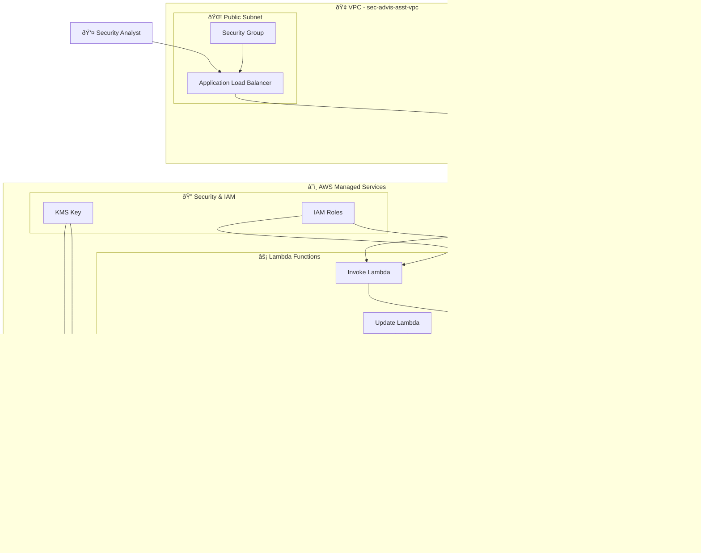

# security-advisory-assistant - Amazon Bedrock model deployed with AWS CDK

## Table of Contents

- [security-advisory-assistant - Amazon Bedrock model deployed with AWS CDK](#security-advisory-assistant---amazon-bedrock-model-deployed-with-aws-cdk)
  - [Table of Contents](#table-of-contents)
  - [Introduction](#introduction)
    - [Where did the idea come from?](#where-did-the-idea-come-from)
    - [Desired user experience](#desired-user-experience)
    - [Benefits of solution](#benefits-of-solution)
  - [Solution overview](#solution-overview)
  - [Evolution of security-advisory-assistant from nothing to MLP](#evolution-of-security-advisory-assistant-from-nothing-to-mlp)
  - [Cost to R\&D](#cost-to-rd)
  - [Next Steps](#next-steps)
  - [Links](#links)
- [Recent Changes](#recent-changes)
  - [Latest Updates (Last 5 Commits)](#latest-updates-last-5-commits)
    - [Streamlit App Update (#8) - Current](#streamlit-app-update-8---current)
    - [Security Enhancements, Dependency Updates, and Code Quality Improvements (#7)](#security-enhancements-dependency-updates-and-code-quality-improvements-7)
    - [Dependency Version Updates](#dependency-version-updates)
    - [Git Configuration Updates](#git-configuration-updates)
    - [Security Vulnerability Fixes (#6)](#security-vulnerability-fixes-6)
    - [Infrastructure Enhancement](#infrastructure-enhancement)
- [Getting Started](#getting-started)
  - [Prerequisites](#prerequisites)
  - [Target technology stack](#target-technology-stack)
  - [Deployment](#deployment)
  - [Useful CDK commands](#useful-cdk-commands)
  - [High-level Code Structure](#high-level-code-structure)
  - [Customize the chatbot with your own data](#customize-the-chatbot-with-your-own-data)
    - [For Knowledgebase Data Integration](#for-knowledgebase-data-integration)
      - [1. Data Preparation](#1-data-preparation)
      - [2. Configuration Adjustments](#2-configuration-adjustments)
    - [For Structural Data Integration](#for-structural-data-integration)
      - [1. Data Organization](#1-data-organization)
      - [2. Configuration and Code Updates](#2-configuration-and-code-updates)
    - [General Update](#general-update)
- [Appendix](#appendix)
  - [Bedrock Prompt example for knowledge base](#bedrock-prompt-example-for-knowledge-base)
  - [example outputs from testing](#example-outputs-from-testing)
    - [https://nvd.nist.gov/vuln/detail/CVE-2021-30665](#httpsnvdnistgovvulndetailcve-2021-30665)
    - [https://nvd.nist.gov/vuln/detail/CVE-2021-30663](#httpsnvdnistgovvulndetailcve-2021-30663)
    - [https://nvd.nist.gov/vuln/detail/CVE-2023-48788](#httpsnvdnistgovvulndetailcve-2023-48788)
    - [https://nvd.nist.gov/vuln/detail/CVE-2024-21887](#httpsnvdnistgovvulndetailcve-2024-21887)
    - [https://nvd.nist.gov/vuln/detail/CVE-2021-30761](#httpsnvdnistgovvulndetailcve-2021-30761)
    - [https://nvd.nist.gov/vuln/detail/CVE-2021-22893](#httpsnvdnistgovvulndetailcve-2021-22893)
    - [https://nvd.nist.gov/vuln/detail/CVE-2020-2509](#httpsnvdnistgovvulndetailcve-2020-2509)
  - [Security](#security)
  - [License](#license)
  - [Security](#security-1)
  - [License](#license-1)

## Introduction

Rather than reinventing the wheel on deploying the required infrastructure via CDK, a large portion of the infrastructure for this solution was taken from [Automate chatbot for document and data retrieval using Agents and Knowledge Bases for Amazon Bedrock](https://aws.amazon.com/blogs/machine-learning/automate-chatbot-for-document-and-data-retrieval-using-agents-and-knowledge-bases-for-amazon-bedrock/) and [Build a Serverless GenAI image creator - Amazon Bedrock model deployed with AWS CDK](https://community.aws/content/2b6vVO87SMvy1cY70GeinjH5ZX3/multimodal?lang=en) and then modified for this specific use case.

This GenAI ChatBot application was built with Amazon Bedrock, which includes KnowledgeBase, Agent, and additional AWS serverless GenAI solutions. The provided solution showcases a Chatbot that makes use of its understanding of Common CNA tasks such as calculating CVSS scores, assigning CWEs, and explaining why decisions were made based on information from FIRST.

The web application is built on [Streamlit](https://streamlit.io/), an open-source Python library that makes it easy to create and share custom web apps for ML and data science. I host the web application using [Amazon Elastic Container Service](https://aws.amazon.com/ecs) (Amazon ECS) with [AWS Fargate](https://docs.aws.amazon.com/AmazonECS/latest/userguide/what-is-fargate.html) and it is accessed via an Application Load Balancer. Fargate is a technology that you can use with Amazon ECS to run [containers](https://aws.amazon.com/what-are-containers) without having to manage servers or clusters or virtual machines. The Bedrock model endpoint is invoked from an  [AWS Lambda](http://aws.amazon.com/lambda) function. The web application interacts with the models via [Amazon API Gateway](https://aws.amazon.com/api-gateway) and [AWS Lambda](http://aws.amazon.com/lambda) function as shown in the diagram below.

This chatbot functions as an illustration of the capabilities of Amazon Bedrock to convert natural language into Amazon Athena queries and to process and utilize complex data sets. Open source tools, such as LLamaIndex, are utilized to augment the system's capabilities for data processing and retrieval. The integration of several AWS resources is also emphasized in the solution. These resources consist of Amazon S3 for storage, Amazon Bedrock KnowledgeBase to facilitate retrieval augmented generation (RAG), Amazon Bedrock agent to execute multi-step tasks across data sources, AWS Glue to prepare data, Amazon Athena to execute efficient queries, Amazon Lambda to manage containers, and Amazon ECS to oversee containers. The combined utilization of these resources empowers the Chatbot to efficiently retrieve and administer content from databases and documents, thereby demonstrating the capabilities of Amazon Bedrock in the development of advanced Chatbot applications.

### Where did the idea come from?

Monday during VulnCon2024[1] at the final panel talk of the day, “Panel Discussion: Enabling Accurate, Decentralized Root Cause Mapping at Scaleâ€[2], I asked the panel a few questions and shared my experience training analysts and the difficulty of getting them to use the CWE provided tools to complete the workflow of selecting the correct CWE for a GHSA/CVE submission.

After airing my concerns, I was approached by Sarah Evans from Dell, who shared my concerns. After a brief discussion and vent session, we decided we needed to do something about it.

An hour later, at the networking event, we brainstormed what to do about it. After workshopping a few ideas with the attendees at our table, we decided to attempt to leverage AWS Bedrock to answer the questions.

### Desired user experience

1. Portable Python script or chatbot webpage as entry point
    1. Went with a portable python script for the first version.
2. User submits a description of a vulnerability
3. The description will be submitted with a custom prompt to AWS Bedrock which will use the prompt to define how AWS Bedrock will interpret the input. Additionally AWS Bedrock will have an associated Knowledge Base to retain information for reference.
    1. In the end this include an export of the CWE database from their website[3]
    2. As well as guidance from multiple pages from the CWE website such as the new to CWE guide[4], user stories[5], faq[6], and the cwe to cve mapping guide [7]
4. The AI will then assess the description submitted by the user against the reference material from the perspective of the prompt and return what CWE the AI determines best fits the described vulnerability. It will also quote why it came to the conclusion that it did by using quotes from both the guidance and CWE database.
5. If you disagree with the CWE suggested, you can ask a follow up question to clarify why it was chosen over another CWE.
6. The AI will respond with a comparison response of why the chosen CWE fits the vulnerability best.

### Benefits of solution

- **Super scalable** All technology used is managed services and static data.
- **No model training required** Anyone without a data science degree can use this.
- **Private** All reference data is private to the user and can be customized to organization specific needs without sharing to any external parties. Hint hint highly regulated industries and companies worried about intellectual property leaks.
- **Extendable and flexible** Anyone can modify this workflow. It is only a custom prompt and custom reference data. Everything else is out of the box services. I didn’t even read the documentation. It was that intuitive.
- **Accurate** Statistically significant accuracy in responses.
- **Incredibly cost effective** All usage of the model over 3 days only totaled $0.41

## Solution overview

Rather than reinventing the wheel on deploying the required infrastructure via CDK, a large portion of the infrastructure for this solution was taken from [Build a Serverless GenAI image creator - Amazon Bedrock model deployed with AWS CDK](https://community.aws/content/2b6vVO87SMvy1cY70GeinjH5ZX3/multimodal?lang=en) and then modified for this specific use case.

The web application is built on [Streamlit](https://streamlit.io/), an open-source Python library that makes it easy to create and share custom web apps for ML and data science. I host the web application using [Amazon Elastic Container Service](https://aws.amazon.com/ecs) (Amazon ECS) with [AWS Fargate](https://docs.aws.amazon.com/AmazonECS/latest/userguide/what-is-fargate.html) and it is accessed via an Application Load Balancer. Fargate is a technology that you can use with Amazon ECS to run [containers](https://aws.amazon.com/what-are-containers) without having to manage servers or clusters or virtual machines. The Bedrock model endpoint is invoked from an  [AWS Lambda](http://aws.amazon.com/lambda) function. The web application interacts with the models via [Amazon API Gateway](https://aws.amazon.com/api-gateway) and [AWS Lambda](http://aws.amazon.com/lambda) function as shown in the following diagram.




API Gateway provides the web application and other clients a standard RESTful interface, while shielding the Lambda function that interfaces with the model. This simplifies the client application code that consumes the models. The API Gateway endpoints are publicly accessible in this example, allowing for the possibility to extend this architecture to implement different [API access controls](https://docs.aws.amazon.com/apigateway/latest/developerguide/apigateway-control-access-to-api.html) and integrate with other applications.

In this post, I will walk you through the following steps:

1. Install the [AWS Command Line Interface](http://aws.amazon.com/cli) (AWS CLI) and [AWS CDK v2](https://docs.aws.amazon.com/cdk/v2/guide/getting_started.html) on your local machine.
2. Clone and set up the AWS CDK application.
3. Deploy the AWS CDK application.
4. Invoke the knowledgebase connected Bedrock model.
5. View the deployed resources on the [AWS Management Console](http://aws.amazon.com/console).

## Evolution of security-advisory-assistant from nothing to MLP

The first version uses a description from a randomly selected CVE on NVD. I asked Sarah Evans to choose a page number and line number from the NVD list and we were brought to <https://nvd.nist.gov/vuln/detail/CVE-2023-48788>.

I took the description text from the page and put it in as the question to AWS Bedrock. It then used reference data and guidance from the Knowledge Base to output the following analysis and correctly choose the same CWE as on the NVD website and gave reasonable supporting reasons for that choice.


But what happens if the AI does not choose the same CWE as we see on the NVD site?


I followed the same process of getting a randomly selected CVE from the NVD list. This time the rest of the table collectively chose page and line numbers that gave us <https://nvd.nist.gov/vuln/detail/CVE-2021-30665>.

In this case the AWS Bedrock Knowledge base evaluated the input against the references and came to the conclusion that a CWE not listed on the NVD page was most appropriate for the issue based on the input. When I asked why one CWE was chosen instead of the expected CWE, the system took quotes from the guidance and reference data to make a convincing argument of why its choice was correct.

Based on this output, would you be convinced to dispute the assigned CWE on this issue? Do you agree with the original CWE?

For the last stage in evolution before the solution is shared, is a more pleasant user experience to interact with the AWS Bedrock Knowledge base. For this, I wanted a webbased chatbot interface and thankfully there are plenty of examples online. Rather than reinvent the wheel, i repurposed the existing Streamlit front end discussed in <https://aws.amazon.com/blogs/machine-learning/build-a-contextual-chatbot-application-using-knowledge-bases-for-amazon-bedrock/> and modified package, hooked it up to my AWS Bedrock Knowledge base, and started things up. Below you can see the final Alpha form of the CWE Chatbot.


## Cost to R&D


Everyone always asks about the cost analysis of this work. I am not sure how to calculate it because of the organic growth of the process, but here are some rough numbers.

- Dev time from no code to working POC MVP:

  - \~2 hours researching what AI options AWS had and what would be easiest to try first.
  - \~3 hours first night developing the python script, creating the JSON files for the knowledge base, and trial an error.
  - \~5 hours total invested in creating, testing, and demoing.  
  - Cost of using bedrock on AWS: $0.41
  - No other services were used.  
  - Time saved for tier 1 analyst: 3hours.
  - It used to take an average of 3hrs for a tier 1 analyst with 15-30 hours of training on CVE, CWE, and vulnerability scoring to correctly relate a CWE for a CVE.
- The version you are seeing in this repo came after the MVP and took more time to create because it uses additional AWS services to facilitate the chatbot style interactions.

Overall, great random project from the networking talks at [#vulncon2024](https://www.linkedin.com/feed/hashtag/?keywords=vulncon2024)

## Next Steps

- Opensourcing this project on GitHub {8}
- Who wants to make one for CVSS scoring?
- Can you improve the accuracy of the CWE suggestions?
- What else can we use this for?

## Links

1. <https://www.first.org/conference/vulncon2024/>
2. <https://www.first.org/conference/vulncon2024/program#pPanel-Discussion-Enabling-Accurate-Decentralized-Root-Cause-Mapping-at-Scale>
3. <https://cwe.mitre.org/data/downloads.html>
4. <https://cwe.mitre.org/about/new_to_cwe.html>
5. <https://cwe.mitre.org/about/user_stories.html>
6. <https://cwe.mitre.org/about/faq.html>
7. <https://cwe.mitre.org/documents/cwe_usage/mapping_examples.html>
8. GitHub for project: TBD

# Recent Changes

## Latest Updates (Last 5 Commits)

### Streamlit App Update (#8) - Current

- Enhanced Streamlit application functionality and user interface improvements
- Updated application components for better user experience

### Security Enhancements, Dependency Updates, and Code Quality Improvements (#7)

- Implemented comprehensive security enhancements across the application
- Updated dependencies to latest secure versions
- Applied code quality improvements and best practices
- Enhanced overall application security posture

### Dependency Version Updates

- Updated requirements.txt file with specific dependency versions
- Ensured compatibility and security across all Python packages
- Standardized dependency management for consistent deployments

### Git Configuration Updates

- Updated .gitignore file to exclude additional unnecessary files
- Improved repository cleanliness and build artifact management

### Security Vulnerability Fixes (#6)

- Resolved 10 critical security vulnerabilities in project dependencies
- Applied security patches to maintain secure application deployment
- Updated vulnerable packages to secure versions

### Infrastructure Enhancement

- Added configurable security group support with SourceIpAddress parameter
- Enhanced CDK deployment to support both specific IP restrictions and open access
- Security group "sec-advis-asst-ChatBotServiceSecurityGroup" now accepts dynamic IP configuration:
  - Use `cdk deploy --parameters SourceIpAddress=$(curl -s https://checkip.amazonaws.com)/32` for current IP restriction
  - Use `cdk deploy` for default open access (0.0.0.0/0)

# Getting Started

## Prerequisites

- Docker
- AWS CDK Toolkit 2.114.1+, installed installed and configured. For more information, see Getting started with the AWS CDK in the AWS CDK documentation.
- Python 3.11+, installed and configured. For more information, see Beginners Guide/Download in the Python documentation.
- An active AWS account
- An AWS account bootstrapped by using AWS CDK in us-east-1 or us-west-2. Enable Claude model and Titan Embedding model access in Bedrock service.

## Target technology stack

- Amazon Bedrock
- Amazon OpenSearch Serverless
- Amazon ECS
- AWS Glue
- AWS Lambda
- Amazon S3
- Amazon Athena
- Elastic Load Balancer

## Deployment

To run the app locally, first add a .env file to 'code/streamlit-app' folder containing the following

```.env
ACCOUNT_ID = <Your account ID>
AWS_REGION = <Your region>
LAMBDA_FUNCTION_NAME =  invokeAgentLambda # Sets name of choice for the lambda function called by streamlit for a response. Currently invokes an agent.
```

The `cdk.json` file tells the CDK Toolkit how to execute your app.

This project is set up like a standard Python project. The initialization
process also creates a virtualenv within this project, stored under the `.venv`
directory. To create the virtualenv it assumes that there is a `python3`
(or `python` for Windows) executable in your path with access to the `venv`
package. If for any reason the automatic creation of the virtualenv fails,
you can create the virtualenv manually.

To manually create a virtualenv on MacOS and Linux:

```bash
python3 -m venv .venv
```

After the init process completes and the virtualenv is created, you can use the following
step to activate your virtualenv.

```bash
source .venv/bin/activate
```

If you are a Windows platform, you would activate the virtualenv like this:

```powershell
% .venv\Scripts\activate.bat
```

Once the virtualenv is activated, you can install the required dependencies.

```bash
pip install -r requirements.txt
```

To add additional dependencies, for example other CDK libraries, just add
them to your `setup.py` file and rerun the `pip install -r requirements.txt`
command.

At this point you can now synthesize the CloudFormation template for this code.

```bash
cdk synth
```

To add additional dependencies, for example other CDK libraries, just add
them to your `setup.py` file and rerun the `pip install -r requirements.txt`
command.

You will need to bootstrap it if this is your first time running cdk at a particular account and region.

```bash
cdk bootstrap
```

Once it's bootstrapped, you can proceed to deploy cdk.

```bash
cdk deploy
```

If this is your first time deploying it, the process may take approximately 30-45 minutes to build several Docker images in ECS (Amazon Elastic Container Service). Please be patient until it's completed. Afterward, it will start deploying the chatbot-stack, which typically takes about 5-8 minutes.

Once the deployment process is complete, you will see the output of the cdk in the terminal, and you can also verify the status in your CloudFormation console.

You can either test the agent in AWS console or through streamlit app url listed in the outputs of chatbot-stack in CloudFormation.

To delete the cdk once you have finished using it to avoid future costs, you can either delete it through the console or execute the following command in the terminal.

```bash
cdk destroy
```

You may also need to manually delete the S3 bucket generated by the cdk. Please ensure to delete all the generated resources to avoid incurring costs.

## Useful CDK commands

- `cdk ls` list all stacks in the app
- `cdk synth` emits the synthesized CloudFormation template
- `cdk deploy` deploy this stack to your default AWS account/region
- `cdk diff` compare deployed stack with current state
- `cdk docs` open CDK documentation
- `cdk destroy` dstroys one or more specified stacks

## High-level Code Structure

```
code                              # Root folder for code for this solution
├── lambdas                           # Root folder for all lambda functions
│   ├── action-lambda                     # Lambda function that acts as an action for the Amazon Bedrock Agent
│   ├── create-index-lambda               # Lambda function that create Amazon Opensearch serverless index as Amazon Bedrock Knowlege base's vector database
│   ├── invoke-lambda                     # Lambda function that invokes Amazon Bedrock Agent, which is called diretly from the streamlit app
│   └── update-lambda                     # Lambda function that update/delete resources after AWS resources deployed via AWS CDK.
├── layers                            # Root folder for all lambda layers
│   ├── boto3_layer                       # Boto3 layer that is shared across all lambdas
│   └── opensearch_layer                  # opensearh layer that installs all dependencies for create Amazon Opensearch serverless index.
├── streamlit-app                         # Steamlit app that interacts with the Amazon Bedrock Agent
└── code_stack.py                     # Amazon CDK stack that deploys all AWS resources
```

## Customize the chatbot with your own data

To integrate your custom data for deploying the solution, please follow these structured guidelines tailored to your requirements:

### For Knowledgebase Data Integration

#### 1. Data Preparation

- Locate the `assets/knowledgebase_data_source/` directory.
- Place your dataset within this folder.

#### 2. Configuration Adjustments

- Access the `cdk.json` file.
- Navigate to the `context/configure/paths/knowledgebase_file_name` field and update it accordingly.
- Further, modify the `bedrock_instructions/knowledgebase_instruction` field in the `cdk.json` file to accurately reflect the nuances and context of your new dataset.

### For Structural Data Integration

#### 1. Data Organization

- Within the `assets/data_query_data_source/` directory, create a subdirectory, for example, tabular_data.
- Deposit your structured dataset (acceptable formats include **CSV**, **JSON**, **ORC**, and **Parquet**) into this newly created subfolder.
- If you are connecting to your **existing database**, update the function `create_sql_engine()` in `code/lambda/action-lambda/build_query_engine.py` to connect to your database.

#### 2. Configuration and Code Updates

- Update the `cdk.json` file's `context/configure/paths/athena_table_data_prefix` field to align with the new data path.
- Revise `code/lambda/action-lambda/dynamic_examples.csv` by incorporating new text to SQL examples that correspond with your dataset.
- Revise `code/lambda/action-lambda/prompt_templates.py` to mirror the attributes of your new tabular data.
- Modify the `cdk.json` file's `context/configure/bedrock_instructions/action_group_description` field to elucidate the purpose and functionality of the action lambda tailored for your dataset.
- Reflect the new functionalities of your action lambda in the `assets/agent_api_schema/artifacts_schema.json` file.

### General Update

- In the `cdk.json` file, under the `context/configure/bedrock_instructions/agent_instruction section`, provide a comprehensive description of the Amazon Bedrock Agent's intended functionality and design purpose, taking into account the newly integrated data.

These steps are designed to ensure a seamless and efficient integration process, enabling you to deploy the solution effectively with your bespoke data.

# Appendix

## Bedrock Prompt example for knowledge base

```
Assistant: You are a security analyst focused on finding the correct CWE to apply to an issue. I'm going to give you an issue. Then I'm going to ask you to choose what CWE and include CWE ID from the database that best fits the issue described. I'd like you provide the top 10 most relevant CWE's and include CWE ID. I'd like you to first write down exact quotes of parts of the document that would help answer the question, and then I'd like you to answer the question using facts from the quoted content.

issue description:

<text>

{{Input}}

</text>

Here are the search results in numbered order:

$search_results$

$output_format_instructions$

Validation tests – NVD records chosen at random
```

## example outputs from testing

### <https://nvd.nist.gov/vuln/detail/CVE-2021-30665>

```
Assistant: You are a security analyst focused on finding the correct CWE to apply to an issue. I'm going to give you an issue. Then I'm going to ask you to choose what CWE and include CWE ID from the database that best fits the issue described. I'd like you provide the top 10 most relevant CWE's and include CWE ID. I'd like you to first write down exact quotes of parts of the document that would help answer the question, and then I'd like you to answer the question using facts from the quoted content.

issue description:

<text>

A memory corruption issue was addressed with improved state management. This issue is fixed in watchOS 7.4.1, iOS 14.5.1 and iPadOS 14.5.1, tvOS 14.6, iOS 12.5.3, macOS Big Sur 11.3.1. Processing maliciously crafted web content may lead to arbitrary code execution. Apple is aware of a report that this issue may have been actively exploited.

</text>

Here are the search results in numbered order:

The issue described seems to best fit CWE-119: Improper Restriction of Operations within the Bounds of a Memory Buffer. This CWE covers flaws that allow reading or writing data outside the intended boundaries of a memory buffer, which can lead to memory corruption and potentially arbitrary code execution.

Other relevant CWEs that could apply include:

CWE-120: Buffer Copy without Checking Size of Input ('Classic Buffer Overflow')

CWE-787: Out-of-bounds Write

CWE-788: Access of Memory Location After End of Buffer

CWE-805: Buffer Access with Incorrect Length Value

CWE-822: Untrusted Pointer Dereference

CWE-824: Access of Uninitialized Pointer

CWE-825: Expired Pointer Dereference

>>>> follow up question asked by human

why did you recommend cwe-119 instead of cwe-787? What made one a better fit than the other?

>>> response from security-advisory-assistant

CWE-119 (Improper Restriction of Operations within the Bounds of a Memory Buffer) is a more general category that covers various types of memory corruption issues, including out-of-bounds writes (CWE-787). Based on the search results, CWE-119 is considered a better fit than CWE-787 for memory corruption issues because:

1. CWE-119 encompasses a broader range of memory corruption vulnerabilities, not just out-of-bounds writes.

2. CWE-787 (Out-of-bounds Write) is a child category of CWE-119, indicating that CWE-119 is a more comprehensive and higher-level classification.

However, the search results also suggest that CWE-119 should be used with caution and only when more specific CWEs cannot be applied. The mapping notes for CWE-119 state that it is commonly misused in low-information vulnerability reports when lower-level CWEs like CWE-787 could be used instead. Therefore, if the memory corruption issue is specifically an out-of-bounds write, it is recommended to use CWE-787 instead of the more general CWE-119.
```

### <https://nvd.nist.gov/vuln/detail/CVE-2021-30663>

```
An integer overflow was addressed with improved input validation. This issue is fixed in iOS 14.5.1 and iPadOS 14.5.1, tvOS 14.6, iOS 12.5.3, Safari 14.1.1, macOS Big Sur 11.3.1. Processing maliciously crafted web content may lead to arbitrary code execution.

Based on the description, the most relevant CWE for this issue is CWE-190: Integer Overflow or Wraparound. This CWE covers situations where an integer value is incremented to a value that is too large to be represented by the integer data type, resulting in a wraparound back to a small value or a negative value. The description mentions that an integer overflow was addressed with improved input validation, indicating that the issue was caused by improper handling of untrusted input leading to an integer overflow vulnerability.

Another relevant CWE is CWE-20: Improper Input Validation. The description states that the issue was fixed by improving input validation, suggesting that the root cause was a lack of proper validation of untrusted input data. Improper input validation can lead to various vulnerabilities, including integer overflows.

CWE-119: Improper Restriction of Operations within the Bounds of a Memory Buffer could also be applicable if the integer overflow led to a buffer overflow vulnerability, allowing arbitrary code execution as mentioned in the description.
```

### <https://nvd.nist.gov/vuln/detail/CVE-2023-48788>

```
An issue was discovered in OpenSSH 7.4 on Amazon Linux 2 and Amazon Linux 1. The fix for CVE-2019-6111 only covered cases where an absolute path is passed to scp. When a relative path is used there is no verification that the name of a file received by the client matches the file requested.  

The issue seems to be related to CWE-22: Improper Limitation of a Pathname to a Restricted Directory ('Path Traversal'). This CWE covers vulnerabilities where the software does not properly neutralize sequences such as "../" that can resolve to a parent directory or other file system locations that are outside of the intended restricted directory.

Specifically, the issue involves a path traversal vulnerability in the scp client of OpenSSH when a relative path is used. The software fails to properly validate that the name of the received file matches the requested file, allowing an attacker to potentially write to arbitrary locations on the client system.
```

### <https://nvd.nist.gov/vuln/detail/CVE-2024-21887>

```
A command injection vulnerability in web components of Ivanti Connect Secure (9.x, 22.x) and Ivanti Policy Secure (9.x, 22.x) allows an authenticated administrator to send specially crafted requests and execute arbitrary commands on the appliance.

The most relevant CWE for this issue is CWE-78: Improper Neutralization of Special Elements used in an OS Command ('OS Command Injection'). This CWE covers vulnerabilities where untrusted input is used to construct an operating system command that is then executed by the application. The key quote from the search results is:

"Command injection vulnerabilities typically occur when: 1. Data enters the application from an untrusted source. 2. The data is part of a string that is executed as a command by the application. 3. By executing the command, the application gives an attacker a privilege or capability that the attacker would not otherwise have." (Source 5)

This directly matches the description of the vulnerability in Ivanti Connect Secure and Ivanti Policy Secure, where an authenticated administrator (untrusted source) can send specially crafted requests (untrusted input) that are executed as commands on the appliance, giving the attacker elevated privileges.

Other potentially relevant CWEs include:

CWE-94: Improper Control of Generation of Code ('Code Injection') - A more general CWE that covers injection of untrusted input as code, including OS commands.

CWE-77: Improper Neutralization of Special Elements used in a Command ('Command Injection') - Similar to CWE-78 but focused specifically on command injection rather than OS command injection.

CWE-639: Inclusion of Sensitive Data in Executable Code - If the injected commands include sensitive data like credentials or keys.

CWE-829: Inclusion of Functionality from Untrusted Control Sphere - If the injected commands come from an untrusted control sphere like an authenticated administrator account.

why did you recommend cwe-78 instead of cwe-77? What made one a better fit than the other?

CWE-78 (Improper Neutralization of Special Elements used in an OS Command) is the appropriate CWE to map command injection vulnerabilities where the attacker can inject separators or other special elements into arguments for an application-controlled program being invoked. This includes cases where the attacker injects command separators into arguments for an OS command.

CWE-77 (Improper Neutralization of Special Elements used in a Command ('Command Injection')) is often misused when CWE-78 was intended. CWE-77 should be used if the weakness involves a command language besides OS shell invocation, such as for database query languages or other command interpreters.
```

### <https://nvd.nist.gov/vuln/detail/CVE-2021-30761>

```
A memory corruption issue was addressed with improved state management. This issue is fixed in iOS 12.5.4. Processing maliciously crafted web content may lead to arbitrary code execution. Apple is aware of a report that this issue may have been actively exploited..

Based on the description "Processing maliciously crafted web content may lead to arbitrary code execution", the most relevant CWE for this issue is CWE-94: Improper Control of Generation of Code ('Code Injection'). This CWE covers vulnerabilities where untrusted input is used to generate code that is then executed, allowing arbitrary code execution.

Another potentially relevant CWE is CWE-119: Improper Restriction of Operations within the Bounds of a Memory Buffer. Since the issue description mentions "memory corruption", it could involve a buffer overflow or other memory access violation that enables arbitrary code execution.

why was CWE-787 not included in the list of choices?

The issue description suggests a buffer overflow vulnerability where data is written beyond the bounds of a buffer, which corresponds to CWE-787: Out-of-bounds Write. This can occur when the length of the data being written exceeds the allocated size of the buffer.

Some relevant quotes from the search results:

"This can result in a buffer over-read (CWE-125) by reading from memory beyond the bounds of the buffer if the message length variable indicates a length that is longer than the size of a message body (CWE-130)." (Source 1)

"Chain: \"Heartbleed\" bug receives an inconsistent length parameter (CWE-130) enabling an out-of-bounds read (CWE-126), returning memory that could include private cryptographic keys and other sensitive data." (Source 2)

The top 10 most relevant CWEs for an out-of-bounds write vulnerability are:

1. CWE-787: Out-of-bounds Write

2. CWE-119: Improper Restriction of Operations within the Bounds of a Memory Buffer

3. CWE-120: Buffer Copy without Checking Size of Input ('Classic Buffer Overflow')

4. CWE-805: Buffer Access with Incorrect Length Value

5. CWE-170: Improper Null Termination

6. CWE-122: Heap-based Buffer Overflow

7. CWE-124: Buffer Underwrite ('Buffer Underflow')

8. CWE-126: Buffer Over-read

9. CWE-127: Buffer Under-read

10. CWE-130: Improper Handling of Length Parameter Inconsistency
```

### <https://nvd.nist.gov/vuln/detail/CVE-2021-22893>

```
Pulse Connect Secure 9.0R3/9.1R1 and higher is vulnerable to an authentication bypass vulnerability exposed by the Windows File Share Browser and Pulse Secure Collaboration features of Pulse Connect Secure that can allow an unauthenticated user to perform remote arbitrary code execution on the Pulse Connect Secure gateway. This vulnerability has been exploited in the wild.

The most relevant CWE for this issue is CWE-287: Improper Authentication, with CWE ID 287. This CWE covers "When an actor claims to have a given identity, the software does not prove or insufficiently proves that the claim is correct." The description of the vulnerability in Pulse Connect Secure indicates that an unauthenticated user can bypass authentication and execute arbitrary code, which aligns with CWE-287.

Another potentially relevant CWE is CWE-639: Authorization Issues, with CWE ID 639. This covers cases where "the software does not perform or incorrectly performs an authorization check when an actor attempts to access resources or functionality." While the main issue seems to be an authentication bypass, improper authorization may also be involved if the unauthenticated user can perform actions requiring elevated privileges.
```

### <https://nvd.nist.gov/vuln/detail/CVE-2020-2509>

```
A command injection vulnerability has been reported to affect QTS and QuTS hero. If exploited, this vulnerability allows attackers to execute arbitrary commands in a compromised application. We have already fixed this vulnerability in the following versions: QTS 4.5.2.1566 Build 20210202 and later QTS 4.5.1.1495 Build 20201123 and later QTS 4.3.6.1620 Build 20210322 and later QTS 4.3.4.1632 Build 20210324 and later QTS 4.3.3.1624 Build 20210416 and later QTS 4.2.6 Build 20210327 and later QuTS hero h4.5.1.1491 build 20201119 and later

Based on the description, the most relevant CWE for this issue is CWE-78: Improper Neutralization of Special Elements used in an OS Command ('OS Command Injection'). This CWE covers vulnerabilities where software fails to neutralize special elements that could be interpreted as OS commands when passing untrusted data to an OS command shell.

The CWE ID for CWE-78 is 78.

Some other potentially relevant CWEs include:

CWE-88: Argument Injection or Modification (ID: 88)

CWE-117: Improper Output Neutralization for Logs (ID: 117)

CWE-119: Improper Restriction of Operations within the Bounds of a Memory Buffer (ID: 119)

CWE-134: Use of Externally-Controlled Format String (ID: 134)

CWE-193: Off-by-one Error (ID: 193)

CWE-470: Use of Externally-Controlled Input to Select Classes or Code ('Unsafe Reflection') (ID: 470)

CWE-625: Permissive Regular Expression (ID: 625)

CWE-641: Improper Restriction of Names for Files and Other Resources (ID: 641)

CWE-694: Use of Multiple Resources with Duplicate Identifier (ID: 694)

### <https://nvd.nist.gov/vuln/detail/CVE-2021-1879>

This issue was addressed by improved management of object lifetimes. This issue is fixed in iOS 12.5.2, iOS 14.4.2 and iPadOS 14.4.2, watchOS 7.3.3. Processing maliciously crafted web content may lead to universal cross site scripting. Apple is aware of a report that this issue may have been actively exploited..

Based on the issue description, the most relevant CWE is CWE-79: Improper Neutralization of Input During Web Page Generation ('Cross-site Scripting'). This CWE covers vulnerabilities where untrusted input is not properly sanitized before being included in web pages, allowing attackers to inject malicious scripts into trusted websites.

Another potentially relevant CWE is CWE-691: Insufficient Control Flow Management. The mention of "improved management of object lifetimes" suggests there may have been issues with control flow and object lifetime management that contributed to the vulnerability.

CWE-668: Exposure of Resource to Wrong Sphere and CWE-300: Channel Accessible by Non-Endpoint could also be applicable, as the issue seems to involve exposing sensitive data or functionality to untrusted parties.
```

## Security

See [SECURITY](SECURITY.md) for more information.

## License

This project is licensed under the MIT No Attribution License.

## Security

See [CONTRIBUTING](CONTRIBUTING.md#security-issue-notifications) for more information.

## License

This library is licensed under the MIT-0 License. See the LICENSE file.
